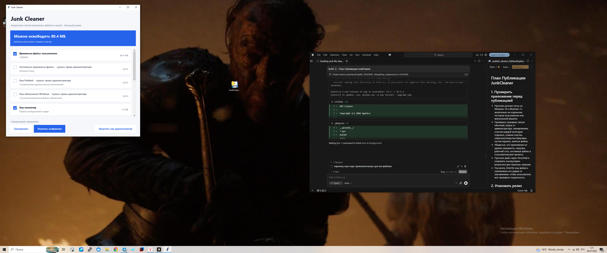

# Junk Cleaner

[](https://github.com/EgorKru/junk-cleaner/releases/latest)
[](https://github.com/EgorKru/junk-cleaner/releases)
[](LICENSE)

**Бесплатный чистильщик мусора для Windows.** Удаляет временные файлы, кэши браузеров и корзину. Системные файлы и личные документы не трогает.

<p align="center">
  <a href="https://github.com/EgorKru/junk-cleaner/releases/latest/download/JunkCleaner-1.0.2-windows.exe"><strong>⬇ Скачать для Windows (бесплатно)</strong></a>
</p>

<p align="center">
  <a href="https://egorkru.github.io/junk-cleaner/">Сайт проекта</a> ·
  <a href="https://github.com/EgorKru/junk-cleaner/issues/new?template=feedback.yml">Оставить отзыв</a>
</p>



## Скачать

| Версия | Ссылка |
|--------|--------|
| **Последняя (рекомендуется)** | [JunkCleaner-1.0.2-windows.exe](https://github.com/EgorKru/junk-cleaner/releases/download/v1.0.2/JunkCleaner-1.0.2-windows.exe) |
| Страница релизов | [GitHub Releases](https://github.com/EgorKru/junk-cleaner/releases) |
| Сайт | [egorkru.github.io/junk-cleaner](https://egorkru.github.io/junk-cleaner/) |

**Как установить:** скачайте `.exe` и запустите. Установка не нужна.

## Что чистит

- Временные файлы пользователя (`%TEMP%`)
- Системные временные файлы (`Windows\Temp`) — нужны права администратора
- Кэш Prefetch — нужны права администратора
- Кэш обновлений Windows — нужны права администратора
- Кэш миниатюр
- Отчёты об ошибках и дампы
- Кэш браузеров: Chrome, Edge, Firefox
- Корзину
- Кэш DNS

## Что НЕ трогает

- Документы, Загрузки, Рабочий стол, Фото, Видео
- Установленные программы
- `Windows\System32` и системные компоненты
- Пароли и закладки браузеров

## Безопасность

- Не собирает личные данные
- Не работает в фоне после закрытия
- Не добавляет автозапуск
- Удаляется простым удалением `.exe`
- Занятые файлы пропускаются автоматически

## Проверка файла (SHA256)

```
0C23778495964A997F3D4DA96F55E3200A2FCDEFFFB4E95BD880FCC3F1B44850
```

```powershell
Get-FileHash .\JunkCleaner-1.0.2-windows.exe -Algorithm SHA256
```

## English

**Junk Cleaner** is a free, lightweight Windows utility that safely removes temporary files, browser caches, thumbnails, crash dumps, and recycle bin contents. No installer required — just download and run.

[Download latest release](https://github.com/EgorKru/junk-cleaner/releases/latest/download/JunkCleaner-1.0.2-windows.exe)

## Сборка из исходников

```bat
py -m pip install pyinstaller pillow
py -m PyInstaller --noconfirm --onefile --windowed --name JunkCleaner --icon assets\junk-cleaner.ico --add-data "assets\junk-cleaner.ico;assets" cleaner.py
```

## Лицензия

MIT
